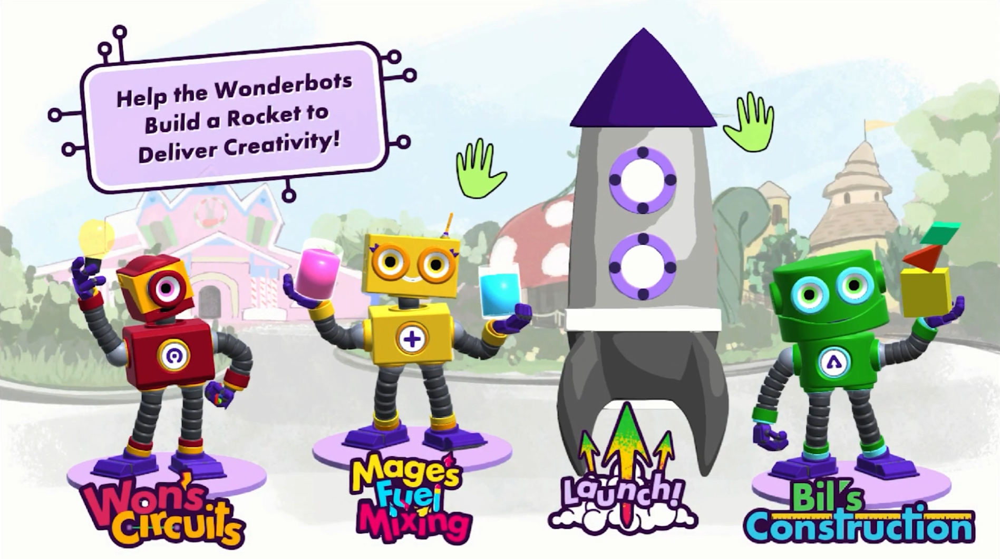
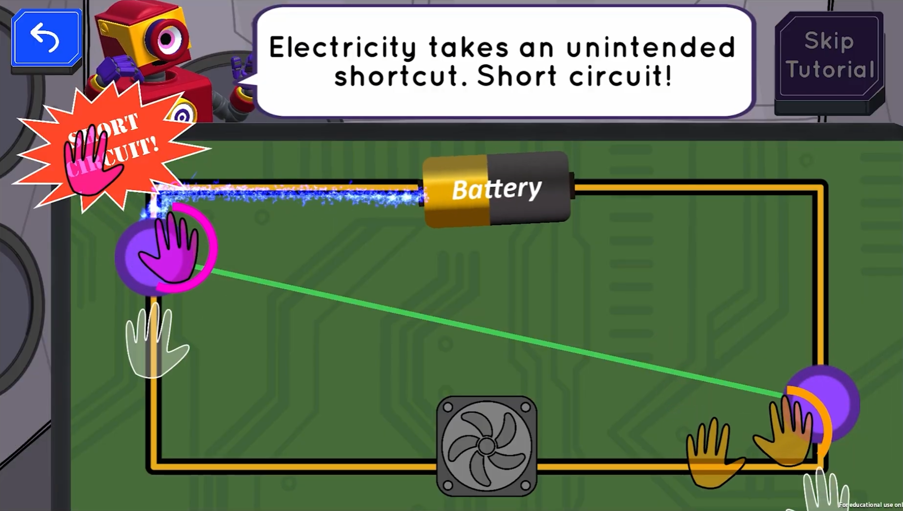
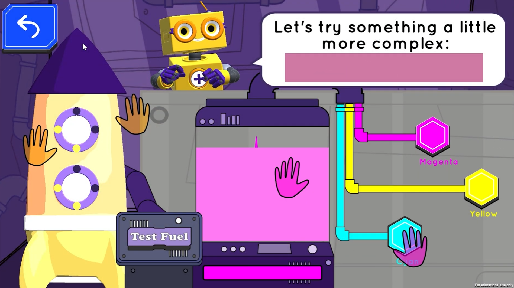
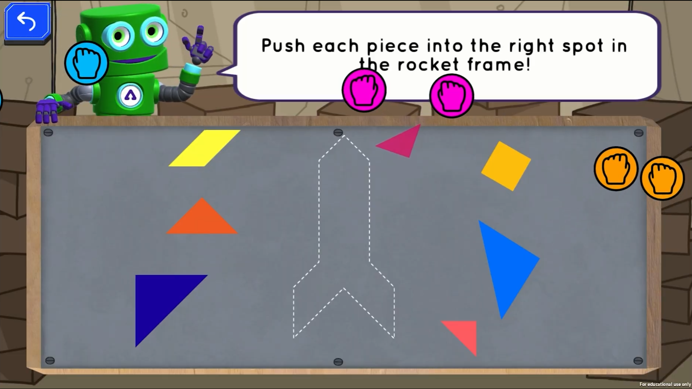
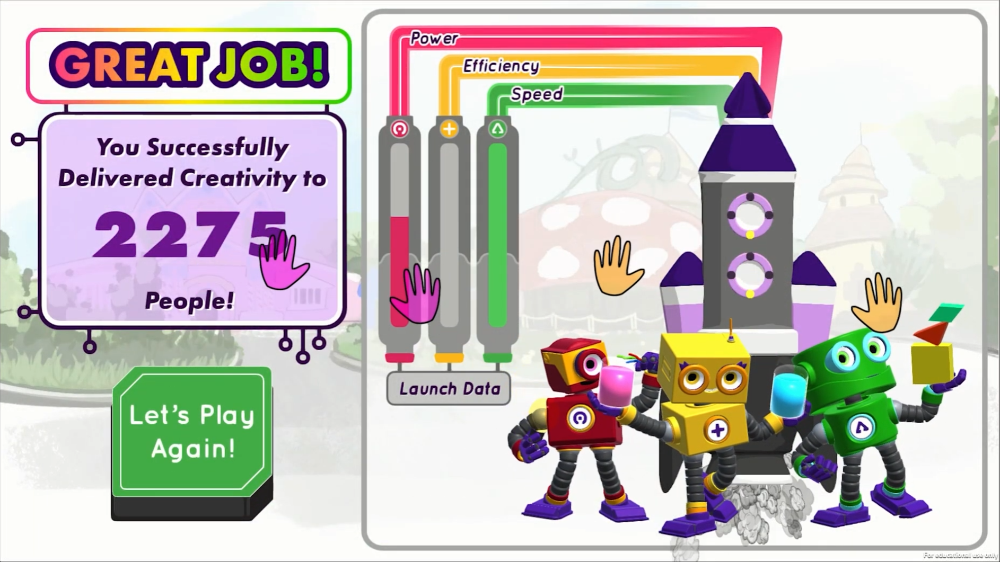
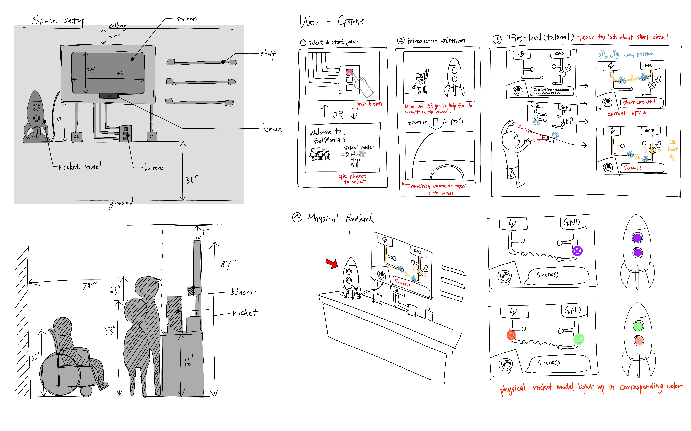
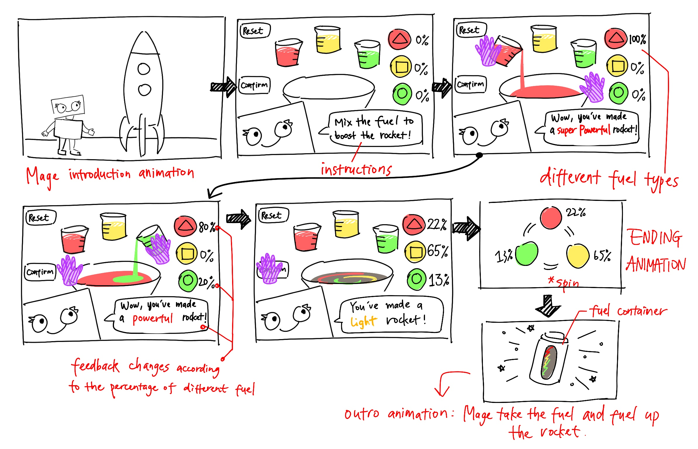
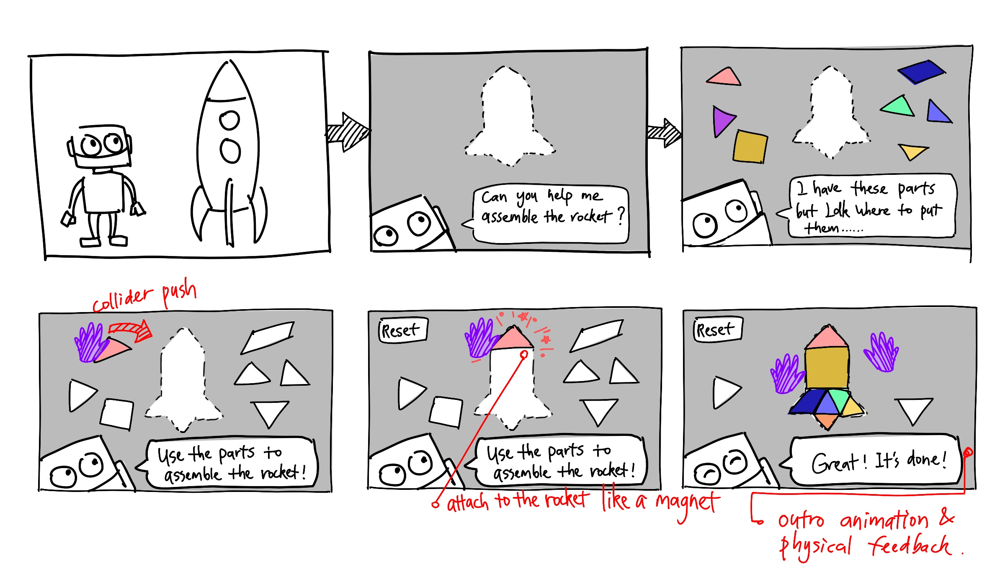

← [Back to Home](/)

# BotMania

**Role:** 2D Artist, UI/UX Designer, Assistant Producer  
**Project Type:** Client project with *Give Kids the World* (non-profit organization)

## Project Overview
BotMania is a **motion-tracking educational game** developed to introduce children to STEAM concepts through embodied interaction and playful learning. The project aimed to create an engaging and accessible experience for young users by combining physical movement with interactive digital content.

## Design and Research Contributions
I designed the end-to-end user experience, including user flow development, storyboard sketching for rapid iteration, UI asset design, and 2D animation production. I also supported production management by coordinating timelines and facilitating cross-disciplinary collaboration.

A central component of the project involved iterative user testing with children in the target age range. I observed user behavior during play sessions, developed design-oriented questions to elicit meaningful feedback, and translated observational insights into design iterations. This process provided hands-on experience with user-centered design, formative evaluation, and qualitative observation methods within an HCI context.

## Project Links
- [Project Website](https://projects.etc.cmu.edu/dreameow/)
- [Demo Video](https://youtu.be/AbI5nsy78gE)

## Design Artifacts & Process

<figure>
  
  <figcaption>Game startscreen.</figcaption>
</figure>

<figure>
  
</figure>

<figure>
  
</figure>

<figure>
  
  <figcaption>Three different games in Botmania that aims to teach student different subjects.</figcaption>
</figure>

<figure>
  
  <figcaption>Game result page.</figcaption>
</figure>

  
<figure>
  
</figure>

<figure>
  
</figure>

<figure>
  
  <figcaption>Early storyboard sketches used for rapid iteration.</figcaption>
</figure>

